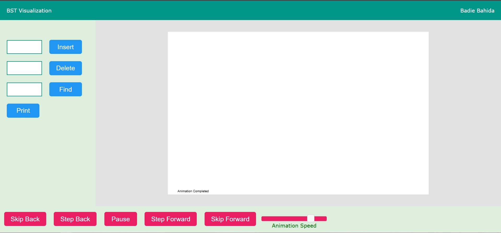

# Binary Search Tree Visualization

A simple interactive visualization tool for understanding how Binary Search Trees (BST) work. This project is developed using **HTML**, **CSS**, and **JavaScript** by **Badie Bahida**.

## 🌳 Features

- Insert nodes into the binary search tree
- Visual representation of the tree structure
- Animated node placement
- Search for a specific value with highlight
- Reset/clear the entire tree
- Responsive and user-friendly interface

## 📷 Preview

 <!-- Add a real screenshot named 'preview.png' -->

## 🚀 Getting Started

### Prerequisites

No installation required! Just open the HTML file in any modern web browser.

### Installation

1. Clone the repository:

```bash
git clone https://github.com/badie16/bst-visualization.git
```
2. Navigate to the project directory:
```bash   
cd bst-visualization
```
Open the index.html file in your browser:
```bash   
start index.html
```
Or simply double-click index.html.

### 🛠️ Technologies Used
HTML – Page structure
CSS – Styling and layout
JavaScript – Tree logic and DOM manipulation

### 📚 How It Works
The user inputs a number.
The algorithm places the number according to BST rules (left < root < right).
Nodes are visually added with animation.
Search highlights the path and the target node if found.

### 📁 File Structure
```graphql
bst-visualization/
│
├── index.html                  # Main HTML file
├── bst-visualizationn_files    # js and css file (style , alogorithme ....)
└── README.md                   # Project documentation
```
### 🙋‍♂️ Author
Badie Bahida
Computer Science & IT Security Student
GitHub: github.com/badie16

### 💡 Future Improvements
Support for deletion of nodes
AVL Tree / Red-Black Tree support
In-order, pre-order, post-order traversal animations
Export tree as an image

### 📝 License
This project is open-source and free to use under the MIT License.
